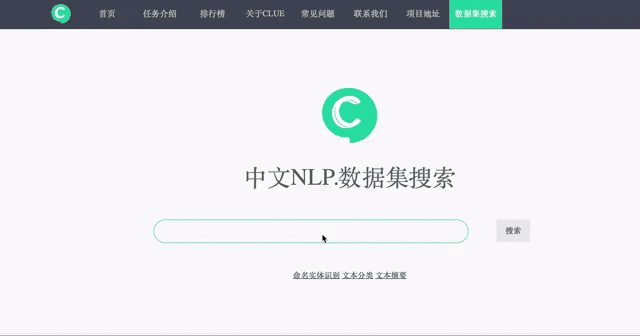

# CLUEDatasetSearch
中英文NLP数据集。可以点击[搜索](https://www.cluebenchmarks.com/dataSet_search.html)。

您可以通过<a href='https://www.cluebenchmarks.com/dataSet_upload.html'>上传数据集信息</a>贡献你的力量。上传五个或以上数据集信息并审核通过后，该同学可以作为项目贡献者，并显示出来。

- [NER](#ner)
- [QA](#qa)
- [情感分析](#情感分析)
- [文本分类](#文本分类)
- [文本匹配](#文本匹配)
- [文本摘要](#文本摘要)
- [机器翻译](#机器翻译)
- [知识图谱](#知识图谱)
- [语料库](#语料库)
- [阅读理解](#阅读理解)
- [贡献与参与](#贡献与参与)

如果数据集有问题，欢迎提出issue。

所有数据集均来源于网络，只做整理供大家提取方便，如果有侵权等问题，请及时联系我们删除。

# NER

| ID   | 标题   | 更新日期 | 数据集提供者 | 许可 | 说明   | 关键字   | 类别 | 论文地址   | 备注 |
| ---- | ------------------------------------------------------------ | --------- | -------------------------------------- | ---- | ------------------------------------------------------------ | ------------ | ------------ | ----------------------------------------------------- | ---- |
| 1    | [CCKS2017中文电子病例命名实体识别](https://biendata.com/competition/CCKS2017_2/data/) | 2017年5月 | 北京极目云健康科技有限公司    |      | 数据来源于其云医院平台的真实电子病历数据，共计800条（单个病人单次就诊记录），经脱敏处理  | 电子病历     | 命名实体识别 | \                                                     | 中文 |
| 2    | [CCKS2018中文电子病例命名实体识别](https://biendata.com/competition/CCKS2018_1/data/) | 2018年    | 医渡云（北京）技术有限公司             |      |  CCKS2018的电子病历命名实体识别的评测任务提供了600份标注好的电子病历文本，共需识别含解剖部位、独立症状、症状描述、手术和药物五类实体  | 电子病历     | 命名实体识别 | \                                                     | 中文 |
| 3    | [微软亚研院MSRA命名实体识别识别数据集](https://github.com/lemonhu/NER-BERT-pytorch/tree/master/data/msra) | \         | MSRA                                   |      |  数据来源于MSRA，标注形式为BIO，共有46365条语料                | Msra         | 命名实体识别 | \                                                     | 中文 |
| 4    | [1998人民日报语料集实体识别标注集](https://github.com/ThunderingII/nlp_ner/tree/master/data) | 1998年1月 | 人民日报                               |      |  数据来源为98年人民日报，标注形式为BIO，共有23061条语料        | 98人民日报   | 命名实体识别 | \                                                     | 中文 |
| 5    | [Boson](https://github.com/TomatoTang/BILSTM-CRF)            | \         | 玻森数据                               |      |  数据来源为Boson，标注形式为BMEO,共有2000条语料                | Boson        | 命名实体识别 | \                                                     | 中文 |
| 6    | [CLUE Fine-Grain NER](https://storage.googleapis.com/cluebenchmark/tasks/cluener_public.zip) | 2020年    | CLUE                                   |      |  CLUENER2020数据集，是在清华大学开源的文本分类数据集THUCTC基础上，选出部分数据进行细粒度命名实体标注，原数据来源于Sina News RSS。数据包含10个标签类别，训练集共有10748条语料，验证集共有1343条语料  | 细粒度；CULE | 命名实体识别 | \                                                     | 中文 |
| 7    | [CoNLL-2003](https://www.clips.uantwerpen.be/conll2003/ner/) | 2003      | CNTS - Language Technology Group       |      |  数据来源于CoNLL-2003的任务，该数据标注了包括PER, LOC, ORG和MISC的四个类别  | CoNLL-2003   | 命名实体识别 | [论文](https://www.aclweb.org/anthology/W03-0419.pdf) | 英文 |
| 8    | [微博实体识别](https://github.com/hltcoe/golden-horse)       | 2015年    | https://github.com/hltcoe/golden-horse |      |                                                                | EMNLP-2015   | 命名实体识别 |                                                       |      |
| 9    | [SIGHAN Bakeoff 2005](http://sighan.cs.uchicago.edu/bakeoff2005/) | 2005年    | MSR/PKU                                |      |                                                                | bakeoff-2005 | 命名实体识别 |                                                       |      |

# QA

| ID   | 标题                                                         | 更新日期  | 数据集提供者 | 许可 | 说明                                                         | 关键字 | 类别 | 论文地址                                                     | 备注 |
| ---- | ------------------------------------------------------------ | --------- | ------------ | ---- | ------------------------------------------------------------ | ------ | ---- | ------------------------------------------------------------ | ---- |
| 1    | [NewsQA](https://github.com/Maluuba/newsqa)                  | 2019/9/13 | 微软研究院   |      |  Maluuba NewsQA数据集的目的是帮助研究社区构建能够回答需要人类水平的理解和推理技能的问题的算法。包含超过12000篇新闻文章和120,000答案，每篇文章平均616个单词，每个问题有2～3个答案。  | 英文   | QA   | [论文](https://arxiv.org/abs/1611.09830)                     |      |
| 2    | [SQuAD](https://rajpurkar.github.io/SQuAD-explorer/)         |           | 斯坦福       |      |  斯坦福问答数据集（SQuAD）是一个阅读理解数据集，由维基百科的一组文章上提出的问题组成，其中每个问题的答案都是一段文本，可能来自相应的阅读段落，或者问题可能是未解答的。  | 英文   | QA   | [论文](https://arxiv.org/abs/1606.05250)                     |      |
| 3    | [SimpleQuestions](https://www.dropbox.com/s/tohrsllcfy7rch4/SimpleQuestions_v2.tgz) |           | Facebook     |      |  基于存储网络的大规模简单问答系统, 数据集提供了一个多任务问答数据集，数据集有100K简单问题的回答。  | 英文   | QA   | [论文](https://arxiv.org/pdf/1506.02075v1.pdf)               |      |
| 4    | [WikiQA](https://www.microsoft.com/en-us/download/details.aspx?id=52419&from=http%3A%2F%2Fresearch.microsoft.com%2Fen-us%2Fdownloads%2F4495da01-db8c-4041-a7f6-7984a4f6a905%2Fdefault.aspx) | 2016/7/14 | 微软研究院   |      |  为了反映一般用户的真实信息需求，WikiQA使用Bing查询日志作为问题源。每个问题都链接到一个可能有答案的维基百科页面。因为维基百科页面的摘要部分提供了关于这个主题的基本且通常最重要的信息，所以使用本节中的句子作为候选答案。在众包的帮助下，数据集中包括3047个问题和29258个句子，其中1473个句子被标记为对应问题的回答句子。  | 英文   | QA   | [论文](https://www.microsoft.com/en-us/research/publication/wikiqa-a-challenge-dataset-for-open-domain-question-answering/?from=http%3A%2F%2Fresearch.microsoft.com%2Fpubs%2F252176%2Fyangyihmeek_emnlp-15_wikiqa.pdf) |      |
| 5    | [cMedQA](https://github.com/zhangsheng93/cMedQA)             | 2019/2/25 | Zhang Sheng  |      |  医学在线论坛的数据，包含5.4万个问题，及对应的约10万个回答。   | 中文   | QA   | [论文](https://www.mdpi.com/2076-3417/7/8/767)               |      |
| 6    | [cMedQA2](https://github.com/zhangsheng93/cMedQA2)           | 2019/1/9  | Zhang Sheng  |      |  cMedQA的扩展版，包含约10万个医学相关问题，及对应的约20万个回答。  | 中文   | QA   | [论文](https://ieeexplore.ieee.org/abstract/document/8548603) |      |
| 7    | [webMedQA](https://github.com/hejunqing/webMedQA)            | 2019/3/10 | He Junqing   |      |  一个医学在线问答数据集，包含6万个问题和31万个回答，而且包含问题的类别。  | 中文   | QA   | [论文](https://bmcmedinformdecismak.biomedcentral.com/articles/10.1186/s12911-019-0761-8) |      |
| 8    | [XQA](https://github.com/thunlp/XQA)                         | 2019/7/29 | 清华大学     |      |  该篇文章主要是针对开放式问答构建了一个跨语言的开放式问答数据集，该数据集（训练集、测试集）主要包括九种语言，9万多个问答。  | 多语言 | QA   | [论文](https://www.aclweb.org/anthology/P19-1227)            |      |
| 9    | [AmazonQA](https://github.com/amazonqa/amazonqa)             | 2019/9/29 | 亚马逊       |      |  卡耐基梅隆大学针对亚马逊平台上问题重复回答的痛点，提出了基于评论的QA模型任务，即利用先前对某一产品的问答，QA系统自动总结出一个答案给客户  | 英文   | QA   | [论文](https://arxiv.org/pdf/1908.04364v1.pdf)               |      |

# 情感分析

| ID   | 标题                                                         | 更新日期 | 数据集提供者                         | 许可 | 说明                                                         | 关键字                       | 类别     | 论文地址                                                     | 备注 |
| ---- | ------------------------------------------------------------ | -------- | ------------------------------------ | ---- | ------------------------------------------------------------ | ---------------------------- | -------- | ------------------------------------------------------------ | ---- |
| 1    | [NLPCC2013](http://tcci.ccf.org.cn/conference/2013/pages/page04_tdata.html) | 2013     | CCF                                  | \    |  微博语料，标注了7 emotions: like, disgust, happiness, sadness, anger, surprise, fear。大小：14 000 条微博, 45 431句子  | NLPCC2013, Emotion           | 情感分析 | [论文](http://jcip.cipsc.org.cn/CN/article/downloadArticleFile.do?attachType=PDF&id=143) |      |
| 2    | [NLPCC2014 Task1](http://tcci.ccf.org.cn/conference/2014/pages/page04_ans.html) | 2014     | CCF                                  | \    |  微博语料，标注了7 emotions: like, disgust, happiness, sadness, anger, surprise, fear。 大小：20000条微博  | NLPCC2014, Emotion           | 情感分析 | \                                                            |      |
| 3    | [NLPCC2014 Task2](http://tcci.ccf.org.cn/conference/2014/pages/page04_tdata.html) | 2014     | CCF                                  | \    |  微博语料，标注了正面和负面                                    | NLPCC2014, Sentiment         | 情感分析 | \                                                            |      |
| 4    | [Weibo Emotion Corpus](https://github.com/MingleiLI/emotion_corpus_weibo) | 2016     | The Hong Kong Polytechnic University | \    |  微博语料，标注了7 emotions: like, disgust, happiness, sadness, anger, surprise, fear。 大小：四万多条微博  | weibo emotion corpus         | 情感分析 | [Emotion Corpus Construction Based on Selection from Noisy Natural Labels](http://www.lrec-conf.org/proceedings/lrec2016/pdf/515_Paper.pdf) |      |
| 5    | [RenCECPs](Fuji Ren can be contacted (ren@is.tokushima-u.ac.jp) for a license agreement.) | 2009     | Fuji Ren                             | \    |  标注的博客语料库，在文档级、段落级和句子级标注了emotion和sentiment。包含了1500个博客，11000段落和35000句子。  | RenCECPs, emotion, sentiment | 情感分析 | [Construction of a blog emotion corpus for Chinese emotional expression analysis](https://dl.acm.org/doi/10.5555/1699648.1699691) |      |
| 6    | [weibo_senti_100k](https://github.com/SophonPlus/ChineseNlpCorpus/blob/master/datasets/weibo_senti_100k/intro.ipynb) | 不详     | 不详                                 | \    |  带情感标注 新浪微博，正负向评论约各 5 万条                    | weibo senti, sentiment       | 情感分析 | \                                                            |      |
| 7    | [BDCI2018-汽车行业用户观点主题及情感识别](https://www.datafountain.cn/competitions/310/datasets) | 2018     | CCF                                  |      |  汽车论坛中对汽车的评论，标注了汽车的诗歌主题：动力、价格、内饰、配置、安全性、外观、操控、油耗、空间、舒适性。每个主题标注了情感标签，情感分为3类，分别用数字0、1、-1表示中立、正向、负向。  | 属性情感分析 主题情感分析    | 情感分析 | \                                                            |      |
| 8    | [AI Challenger 细粒度用户评论情感分析](https://blog.csdn.net/linxid/article/details/82764682) | 2o18     | 美团                                 | \    |  餐饮评论，6个一级属性，20个二级属性，每个属性标注正面、负面、中性、未提及。  | 属性情感分析                 | 情感分析 | \                                                            |      |
| 9    | [BDCI2019金融信息负面及主体判定](https://www.datafountain.cn/competitions/353) | 2019     | 中原银行                             | \    |  金融领域新闻，每个样本标记了实体列表以及负面实体列表。任务是判断一个样本是否是负面以及对应的负面的实体。  | 实体情感分析                 | 情感分析 | \                                                            |      |
| 10   | [之江杯电商评论观点挖掘大赛](https://zhejianglab.aliyun.com/entrance/231731/introduction?spm=5176.12281949.1003.3.2b58c341YnOFck) | 2019     | 之江实验室                           | \    |  本次品牌评论观点挖掘的任务是在商品评论中抽取商品属性特征和消费者观点，并确认其情感极性和属性种类。对于商品的某一个属性特征，存在着一系列描述它的观点词，它们代表了消费者对该属性特征的观点。每一组{商品属性特征，消费者观点}具有相应的情感极性（负面、中性、正面），代表了消费者对该属性的满意程度。此外，多个属性特征可以归入某一个属性种类，例如外观、盒子等属性特征均可归入包装这个属性种类。参赛队伍最终需提交对测试数据的抽取预测信息，包括属性特征词、观点词、观点极性和属性种类4个字段。  | 属性情感分析                 | 情感分析 | \                                                            |      |
| 11   | [2019搜狐校园算法大赛](https://biendata.com/competition/sohu2019/) | 2019     | 搜狐                                 | \    |  给定若干文章，目标是判断文章的核心实体以及对核心实体的情感态度。每篇文章识别最多三个核心实体，并分别判断文章对上述核心实体的情感倾向（积极、中立、消极三种）。实体：人、物、地区、机构、团体、企业、行业、某一特定事件等固定存在，且可以作为文章主体的实体词。核心实体：文章主要描述、或担任文章主要角色的实体词。  | 实体情感分析                 | 情感分析 | \                                                            |      |

# 文本分类

| ID   | 标题                                                         | 更新日期      | 数据集提供者                                             | 许可             | 说明                                                         | 关键字           | 类别     | 论文地址 | 备注 |
| ---- | ------------------------------------------------------------ | ------------- | -------------------------------------------------------- | ---------------- | ------------------------------------------------------------ | ---------------- | -------- | -------- | ---- |
| 1    | [2018“达观杯”文本智能处理挑战赛](https://www.pkbigdata.com/common/cmpt/ “达观杯”文本智能处理挑战赛_赛体与数据.html) | 2018年7月     | 达观数据                                                 |                  |  数据集来源于达观数据，为长文本分类任务，其主要包括了id，article，word_seg和class四个字段，数据包含19个类别，共102275条样本  | 长文本；脱敏     | 文本分类 | \        | 中文 |
| 2    | [今日头条中文新闻（文本）分类](https://github.com/skdjfla/toutiao-text-classfication-dataset) | 2018年5月     | 今日头条                                                 |                  |  数据集来源于今日头条，为短文本分类任务，数据包含15个类别，共382688条样本  | 短文本；新闻     | 文本分类 | \        | 中文 |
| 3    | [THUCNews中文文本分类]([http://thuctc.thunlp.org/#%E4%B8%AD%E6%96%87%E6%96%87%E6%9C%AC%E5%88%86%E7%B1%BB%E6%95%B0%E6%8D%AE%E9%9B%86THUCNews](http://thuctc.thunlp.org/#中文文本分类数据集THUCNews)) | 2016年        | 清华大学                                                 |                  | THUCNews是根据新浪新闻RSS订阅频道2005~2011年间的历史数据筛选过滤生成，均为UTF-8纯文本格式。我们在原始新浪新闻分类体系的基础上，重新整合划分出14个候选分类类别：财经、彩票、房产、股票、家居、教育、科技、社会、时尚、时政、体育、星座、游戏、娱乐，共74万篇新闻文档（2.19 GB） | 文档；新闻       | 文本分类 | \        | 中文 |
| 4    | [复旦大学中文文本分类](https://www.kesci.com/home/dataset/5d3a9c86cf76a600360edd04) | \             | 复旦大学计算机信息与技术系国际数据库中心自然语言处理小组 |                  |  数据集来源于复旦大学，为短文本分类任务，数据包含20个类别，共9804篇文档  | 文档；新闻       | 文本分类 | \        | 中文 |
| 5    | [新闻标题短文本分类](https://www.kesci.com/home/dataset/5dd645fca0cb22002c94e65d/files) | 2019年12月    | chenfengshf                                              | CC0 公共领域共享 |  数据集来源于Kesci平台，为新闻标题领域短文本分类任务。内容大多为短文本标题(length<50)，数据包含15个类别，共38w条样本  | 短文本；新闻标题 | 文本分类 | \        | 中文 |
| 6    | [2017 知乎看山杯机器学习挑战赛](https://biendata.com/competition/zhihu/) | 2017年6月     | 中国人工智能学会;知乎                                    |                  |  数据集来源于知乎，为问题及话题标签的绑定关系的标注数据，每个问题有 1 个或多个标签，累计1999 个标签，共包含 300 万个问题  | 问题；短文本     | 文本分类 | \        | 中文 |
| 7    | [2019之江杯-电商评论观点挖掘大赛](https://zhejianglab.aliyun.com/entrance/231731/information) | 2019年8月     | 之江实验室                                               |                  |  本次品牌评论观点挖掘的任务是在商品评论中抽取商品属性特征和消费者观点，并确认其情感极性和属性种类。对于商品的某一个属性特征，存在着一系列描述它的观点词，它们代表了消费者对该属性特征的观点。每一组{商品属性特征，消费者观点}具有相应的情感极性（负面、中性、正面），代表了消费者对该属性的满意程度  | 评论；短文本     | 文本分类 | \        | 中文 |
| 8    | [IFLYTEK' 长文本分类](https://storage.googleapis.com/cluebenchmark/tasks/iflytek_public.zip) | \             | 科大讯飞                                                 |                  |  该数据集共有1.7万多条关于app应用描述的长文本标注数据，包含和日常生活相关的各类应用主题，共119个类别  | 长文本           | 文本分类 | \        | 中文 |
| 9    | [全网新闻分类数据(SogouCA)](http://www.sogou.com/labs/resource/ca.php) | 2012年8月16号 | 搜狗                                                     |                  |  该数据来自若干新闻站点2012年6月—7月期间国内，国际，体育，社会，娱乐等18个频道的新闻数据  | 新闻             | 文本分类 | \        | 中文 |
| 10   | [搜狐新闻数据(SogouCS)](http://www.sogou.com/labs/resource/cs.php) | 2012年8月     | 搜狗                                                     |                  |  数据来源为搜狐新闻2012年6月—7月期间国内，国际，体育，社会，娱乐等18个频道的新闻数据  | 新闻             | 文本分类 | \        | 中文 |
| 11   | [中科大新闻分类语料库](http://www.nlpir.org/?action-viewnews-itemid-145) | 2017年11月    | 刘禹 中国科学院自动化研究所综合信息中心                  |                  |  暂时不能下载，已经联系作者，等待反馈                          | 新闻             |          |          |      |
| 12   | [ChnSentiCorp_htl_all](https://github.com/SophonPlus/ChineseNlpCorpus/tree/master/datasets) | 2018年3月     | https://github.com/SophonPlus/ChineseNlpCorpus           |                  |  7000 多条酒店评论数据，5000 多条正向评论，2000 多条负向评论   |                  |          |          |      |
| 13   | [waimai_10k](https://github.com/SophonPlus/ChineseNlpCorpus/tree/master/datasets) | 2018年3月     | https://github.com/SophonPlus/ChineseNlpCorpus           |                  |  某外卖平台收集的用户评价，正向 4000 条，负向 约 8000 条       |                  |          |          |      |
| 14   | [online_shopping_10_cats](https://github.com/SophonPlus/ChineseNlpCorpus/tree/master/datasets) | 2018年3月     | https://github.com/SophonPlus/ChineseNlpCorpus           |                  |  10 个类别，共 6 万多条评论数据，正、负向评论各约 3 万条， 包括书籍、平板、手机、水果、洗发水、热水器、蒙牛、衣服、计算机、酒店  |                  |          |          |      |
| 15   | [weibo_senti_100k](https://github.com/SophonPlus/ChineseNlpCorpus/tree/master/datasets) | 2018年3月     | https://github.com/SophonPlus/ChineseNlpCorpus           |                  |  10 万多条，带情感标注 新浪微博，正负向评论约各 5 万条         |                  |          |          |      |
| 16   | [simplifyweibo_4_moods](https://github.com/SophonPlus/ChineseNlpCorpus/tree/master/datasets) | 2018年3月     | https://github.com/SophonPlus/ChineseNlpCorpus           |                  |  36 万多条，带情感标注 新浪微博，包含 4 种情感， 其中喜悦约 20 万条，愤怒、厌恶、低落各约 5 万条  |                  |          |          |      |
| 17   | [dmsc_v2](https://github.com/SophonPlus/ChineseNlpCorpus/tree/master/datasets) | 2018年3月     | https://github.com/SophonPlus/ChineseNlpCorpus           |                  |  28 部电影，超 70 万 用户，超 200 万条 评分/评论 数据          |                  |          |          |      |
| 18   | [yf_dianping](https://github.com/SophonPlus/ChineseNlpCorpus/tree/master/datasets) | 2018年3月     | https://github.com/SophonPlus/ChineseNlpCorpus           |                  |  24 万家餐馆，54 万用户，440 万条评论/评分数据                 |                  |          |          |      |
| 19   | [yf_amazon](https://github.com/SophonPlus/ChineseNlpCorpus/tree/master/datasets) | 2018年3月     | https://github.com/SophonPlus/ChineseNlpCorpus           |                  |  52 万件商品，1100 多个类目，142 万用户，720 万条评论/评分数据  |                  |          |          |      |

# 文本匹配

| ID   | 标题                                                         | 更新日期       | 数据集提供者                                  | 许可                                                   | 说明                                                         | 关键字                                                       | 类别                       | 论文地址                                                     | 备注 |
| ---- | ------------------------------------------------------------ | -------------- | --------------------------------------------- | ------------------------------------------------------ | ------------------------------------------------------------ | ------------------------------------------------------------ | -------------------------- | ------------------------------------------------------------ | ---- |
| 1    | [LCQMC](http://icrc.hitsz.edu.cn/Article/show/171.html)      | 2018/6/6       | 哈工大(深圳)智能计算研究中心                  | Creative Commons Attribution 4.0 International License |  该数据集共包含来自多个领域的260068个中文问句对，相同询问意图的句子对标记为1，否则为0；并预先将其切分为了训练集：238766对，验证集：8802对，测试集：12500对  | 大规模问句匹配；意图匹配                                     | 短文本匹配；问句匹配       | [论文](https://www.aclweb.org/anthology/C18-1166)            |      |
| 2    | [The BQ Corpus](http://icrc.hitsz.edu.cn/Article/show/175.html) | 2018/9/4       | 哈工大(深圳)智能计算研究中心；微众银行        |                                                        |  该数据集共有120000个句子对，来自银行一年中的咨询服务日志；句子对包含不同的意图，标记正负样本比例为1:1  | 银行服务问句；意图匹配                                       | 短文本匹配；问句一致性检测 | [论文](https://www.aclweb.org/anthology/D18-1536/)           |      |
| 3    | [AFQMC 蚂蚁金融语义相似度](https://dc.cloud.alipay.com/index?click_from=MAIL&_bdType=acafbbbiahdahhadhiih#/topic/intro?id=3) | 2018/4/25      | 蚂蚁金服                                      |                                                        | 提供10万对的标注数据（分批次更新，已更新完毕），作为训练数据，包括同义对和不同义对 | 金融问句                                                     | 短文本匹配；问句匹配       |                                                              |      |
| 4    | [第三届拍拍贷“魔镜杯”大赛](https://ai.ppdai.com/mirror/goToMirrorDetail?mirrorId=1) | 2018/6/10      | 拍拍贷智慧金融研究院                          |                                                        |  train.csv文件包含3列，分别是标签（label，表示问题1和问题2是否表示相同的意思，1表示相同，0表示不同），问题1的编号（q1）和问题2的编号（q2）。本文件中出现的所有问题编号均在question.csv中出现过  | 金融产品                                                     | 短文本匹配；问句匹配       |                                                              |      |
| 5    | [CAIL2019相似案例匹配大赛](https://github.com/china-ai-law-challenge/CAIL2019/tree/master/scm) | 2019/6         | 清华大学；中国裁判文书网                      |                                                        |  对于每份数据，用三元组(A,B,C)来代表该组数据，其中A,B,C均对应某一篇文书。文书数据A与B的相似度总是大于A与B的相似度的，即sim(A,B)>sim(A,C)  | 法律文书；相似案例                                           | 长文本匹配                 |                                                              |      |
| 6    | [CCKS 2018 微众银行智能客服问句匹配大赛](https://biendata.com/competition/CCKS2018_3/data/) | 2018/4/5       | 哈工大(深圳)智能计算研究中心；微众银行        |                                                        |                                                                | 银行服务问句；意图匹配                                       | 短文本匹配；问句匹配       |                                                              |      |
| 7    | [ChineseTextualInference](https://github.com/liuhuanyong/ChineseTextualInference) | 2018/12/15     | 刘焕勇，中国科学院软件研究所                  |                                                        |  中文文本推断项目,包括88万文本蕴含中文文本蕴含数据集的翻译与构建,基于深度学习的文本蕴含判定模型构建  | 中文NLI                                                      | 中文文本推断；文本蕴含     |                                                              |      |
| 8    | [NLPCC-DBQA](https://biendata.com/ccf_tcci2018/datasets/tcci_tag/11) | 2016/2017/2018 | NLPCC                                         |                                                        |  给定问题-答案，以及该答案是否是该问题的答案之一的标记，1表示是，0表示不是  | DBQA                                                         | 问答匹配                   |                                                              |      |
| 9    | [“技术需求”与“技术成果”项目之间关联度计算模型](https://www.datafountain.cn/competitions/359) | 201/8/32       | CCF                                           |                                                        |  给定文本形式的技术需求和技术成果，以及需求与成果的关联度标签；其中技术需求与技术成果之间的关联度分为四个层级： 强相关、较强相关、弱相关、无相关  | 长文本；需求与成果匹配                                       | 长文本匹配                 |                                                              |      |
| 10   | [CNSD / CLUE-CMNLI](https://github.com/zengjunjun/CNSD)      | 2019/12        | ZengJunjun                                    |                                                        |  中文自然语言推理数据集，本数据及通过翻译加部分人工修正的方法，从英文原数据集生成，可以一定程度缓解中文自然语言推理和语义相似度计算数据集不够的问题  | 中文NLI                                                      | 中文自然语言推断           | [论文](https://6a75-junzeng-uxxxm-1300734931.tcb.qcloud.la/CNSD.pdf?sign=401485f4d6f256393a264e68464ca4ae&t=1578114336) |      |
| 11   | [cMedQA v1.0](https://github.com/zhangsheng93/cMedQA)        | 2017/4/5       | 寻药寻医网 和国防科技大学 信息系统及管理 学院 |                                                        |  该数据集来源为寻医寻药网站中的提问和回答， 数据集做过匿名处理，提供的是包含 训练集中有50,000个问题，94,134个答案，平均每个问题、答案字符数分别为为120、212个； 验证集有2,000个问题，有3774个答案，问题和答案的平均字符数分别为117和212个； 测试集有2,000个问题，有3835个答案，问题和答案的平均字符数分别为119和211个； 数据集总量有54,000个问题，101,743个答案，平均每个问题和答案的字符数分别为119、212个；  | 医疗问答匹配                                                 | 问答匹配                   | [论文](https://www.mdpi.com/2076-3417/7/8/767)               |      |
| 12   | [cMedQA2](https://github.com/zhangsheng93/cMedQA2)           | 2018/11/8      | 寻药寻医网 和国防科技大学 信息系统及管理 学院 |                                                        |  该数据集来源为寻医寻药网站中的提问和回答， 数据集做过匿名处理，提供的是包含 训练集中有100,000个问题，188,490个答案，平均每个问题、答案字符数分别为为48、101个； 验证集有4,000个问题，有7527个答案，问题和答案的平均字符数分别为49和101个； 测试集有4,000个问题，有7552个答案，问题和答案的平均字符数分别为49和100个； 数据集总量有108,000个问题，203,569个答案，平均每个问题和答案的字符数分别为49、101个；  | 医疗问答匹配                                                 | 问答匹配                   | [论文](https://www.mdpi.com/2076-3417/7/8/767)               |      |
| 13   | [ChineseSTS](https://github.com/IAdmireu/ChineseSTS)         | 2017/9/21      | 唐善成, 白云悦, 马付玉.  西安科技大学         |                                                        |  该数据集提供了12747对中文相似数据集，在数据集后 作者给出了他们相似度的打分，语料由短句构成。  | 短句相似度 匹配                                              | 相似度匹配                 |                                                              |      |
| 14   | [中国健康信息处理会议 举办的医疗问题相似度 衡量竞赛数据集](https://biendata.com/competition/chip2018/) | 2018           | CHIP 2018-第四届中国健康信息处理会议（CHIP）  |                                                        |  本次评测任务的主要目标是针对中文的真实患者健康咨询语料，进行问句意图匹配。 给定两个语句，要求判定两者意图是否相同或者相近。 所有语料来自互联网上患者真实的问题，并经过了筛选和人工的意图匹配标注。 数据集经过脱敏处理，问题由数字标示 训练集包含20000条左右标注好的数据（经过脱敏处理，包含标点符号），  测试集包含10000条左右无label的数据（经过脱敏处理，包含标点> 符号）。  | 医疗问题相似度 匹配                                          | 相似度匹配                 |                                                              |      |
| 15   | [COS960: A Chinese Word Similarity Dataset of 960 Word Pairs](https://github.com/thunlp/COS960) | 2019/6/6       | 清华大学                                      |                                                        |  该数据集中包含了960对单词， 并且每对单词都被15个母语者用相似度分数来衡量 这960个词对根据标签被分成三组， 包含480对名词，240对动词和240对形容词。  | 单词之间的相似度                                             | 同义词                     | [论文](https://arxiv.org/abs/1906.00247)                     |      |
| 16   | OPPO手机搜索排序query-title语义匹配数据集。(https://pan.baidu.com/s/1Hg2Hubsn3GEuu4gubbHCzw  密码7p3n) | 2018/11/6      | OPPO                                          |                                                        |  该数据集来自于OPPO手机搜索排序优化实时搜索场景, 该场景就是在用户不断输入过程中，实时返回查询结果。 该数据集在此基础上做了相应的简化， 提供了一个query-title语义匹配，即ctr预测的问题。  | 问题标题匹配， ctr预测                                       | 相似度匹配                 |                                                              |      |
| 17   | [网页搜索结果评价(SogouE)](https://www.sogou.com/labs/resource/e.php) | 2012年         | 搜狗                                          | 搜狗实验室数据使用许可协议                             |  该数据集包含了查询词，相关URL以及查询类别的搜索数据，格式如下 数据格式说明：查询词]\t相关的URL\t查询类别 其中URL保证存在于对应的互联网语料库； 查询类别中“1”表示导航类查询；“2”表示信息类查询  | [Automatic Search Engine Performance Evaluation with Click-through Data Analysis](https://www.sogou.com/labs/paper/Automatic_Search_Engine_Performance_Evaluation_with_Click-through_Data_Analysis.pdf) | 查询类型匹配预测           |                                                              |      |

# 文本摘要

| ID   | 标题                                                         | 更新日期   | 数据集提供者                                          | 许可   | 说明                                                         | 关键字                         | 类别     | 论文地址                                              | 备注       |
| ---- | ------------------------------------------------------------ | ---------- | ----------------------------------------------------- | ------ | ------------------------------------------------------------ | ------------------------------ | -------- | ----------------------------------------------------- | ---------- |
| 1    | [LCSTS](http://icrc.hitsz.edu.cn/Article/show/139.html)      | 2015/8/6   | Qingcai Chen                                          |        |  数据集来源于新浪微博，包含两百万左右真实中文短文本，每条数据包括由作者标注的摘要和正文两个字段。另外有10,666条数据由人工标注出短文本与摘要的相关性，从1-5相关性依次增加。  | 单文本摘要；短文本；文本相关性 | 文本摘要 | [论文](http://arxiv.org/abs/1506.05865)               |            |
| 2    | [中文短文本摘要数据集](https://www.jianshu.com/p/8f52352f0748?tdsourcetag=s_pcqq_aiomsg) | 2018/6/20  | He Zhengfang                                          |        |  数据来源于新浪微博主流媒体发布的微博，共679898条数据。        | 单文本摘要；短文本             | 文本摘要 | \                                                     |            |
| 3    | [教育培训行业抽象式自动摘要中文语料库](https://github.com/wonderfulsuccess/chinese_abstractive_corpus) | 2018/6/5   | 匿名                                                  |        |  语料库收集了教育培训行业主流垂直媒体的历史文章，约24500条数据，每条数据包括由作者标注的摘要和正文两个字段。  | 单文本摘要；教育培训           | 文本摘要 | \                                                     |            |
| 4    | [NLPCC2017 Task3](http://tcci.ccf.org.cn/conference/2017/taskdata.php) | 2017/11/8  | NLPCC2017主办方                                       |        |  数据集来源于新闻领域，是NLPCC2017举办提供的任务数据，可用于单文本摘要。  | 单文本摘要；新闻               | 文本摘要 | \                                                     |            |
| 5    | [神策杯2018](https://www.dcjingsai.com/common/cmpt/“神策杯”2018高校算法大师赛_竞赛信息.html) | 2018/10/11 | DC竞赛主办方                                          |        |  数据来源于新闻文本，由DC竞赛主办方提供，模拟业务场景，以新闻文本的核心词提取为目的，最终结果达到提升推荐和用户画像的效果。  | 文本关键字；新闻               | 文本摘要 | \                                                     |            |
| 6    | [Byte Cup 2018国际机器学习竞赛](http://biendata.com/competition/bytecup2018/data/) | 2018/12/4  | 字节跳动                                              |        |  数据来自字节跳动旗下产品TopBuzz和开放版权的文章，训练集包括了约 130 万篇文本的信息，验证集 1000 篇文章， 测试集 800 篇文章。 每条测试集和验证集的数据经由人工编辑手工标注多个可能的标题，作为答案备选。  | 单文本摘要；视频；新闻         | 文本摘要 | \                                                     | 英文       |
| 7    | [NEWSROOM](https://summari.es/)                              | 2018/6/1   | Grusky                                                |        |  数据是从1998年到2017年的搜索和社交元数据中获得，并使用了多种提取和抽象相结合的摘要策略，包含作者和编辑在38个主要出版物编辑部撰写的130万篇文章和摘要。  | 单文本摘要；社交元数据；搜索   | 文本摘要 | [论文](http://aclweb.org/anthology/N18-1065)          | 英文       |
| 8    | [DUC/TAC](https://duc.nist.gov/ https://tac.nist.gov//)      | 2014/9/9   | NIST                                                  |        |  全称Document Understanding Conferences/Text Analysis Conference，数据集来源于每年的TAC KBP（TAC Knowledge Base Population）比赛使用的语料库中的新闻专线和网络文本。  | 单文本/多文本摘要；新闻        | 文本摘要 | \                                                     | 英文       |
| 9    | [CNN/Daily Mail](https://cs.nyu.edu/~kcho/DMQA/)             | 2017/7/31  | Standford                                             | GNU v3 |  数据集是从美国有线新闻网（CNN）和每日邮报(DailyMail)中手机大约一百万条新闻数据作为机器阅读理解语料库。  | 多文本摘要；长文本；新闻       | 文本摘要 | [论文](https://arxiv.org/pdf/1704.04368.pdf)          | 英文       |
| 10   | [Amazon SNAP Review](https://snap.stanford.edu/data/web-Amazon.html) | 2013/3/1   | Standford                                             |        |  数据来源于Amazon网站购物评论，可以获取每个大类别（如美食、电影等）下的数据，也可以一次性获取所有数据。  | 多文本摘要；购物评论           | 文本摘要 | \                                                     | 英文       |
| 11   | [Gigaword](https://github.com/harvardnlp/sent-summary)       | 2003/1/28  | David Graff, Christopher Cieri                        |        |  数据集包括约950w 篇新闻文章，用文章标题做摘要，属于单句摘要数据集。  | 单文本摘要；新闻               | 文本摘要 |                                                       | 英文       |
| 12   | [RA-MDS](http://www1.se.cuhk.edu.hk/~textmine/dataset/ra-mds/) | 2017/9/11  | Piji Li                                               |        |  全称Reader-Aware Multi-Document Summarization，数据集来源于新闻文章，由专家收集、标注和审查。涵盖了45个主题，每个主题包含10个新闻文档和4个模型摘要，每个新闻文档平均包含27个句子，每个句子平均包含25个单词。  | 多文本摘要；新闻；人工标注     | 文本摘要 | [论文](http://lipiji.com/docs/li2017ramds.pdf)        | 英文       |
| 13   | [TIPSTER SUMMAC](https://www-nlpir.nist.gov/related_projects/tipster_summac/cmp_lg.html) | 2003/5/21  | The MITRE Corporation and the University of Edinburgh |        |  数据由183篇Computation and Language (cmp-lg) collection标记的文档组成，文档取自ACL会议发表论文。  | 多文本摘要；长文本             | 文本摘要 | \                                                     | 英文       |
| 14   | [WikiHow](http://www.wikihow.com/)                           | 2018/10/18 | Mahnaz Koupaee                                        |        |  每条数据为一篇文章，每篇文章由多个段落组成，每个段落以一个总结它的句子开头。通过合并段落形成文章和段落大纲形成摘要，数据集的最终版本包含了超过200,000个长序列对。  | 多文本摘要；长文本             | 文本摘要 | [论文](https://arxiv.org/abs/1810.09305)              | 英文       |
| 15   | [Multi-News](https://github.com/Alex-Fabbri/Multi-News)      | 2019/12/4  | Alex Fabbri                                           |        |  数据来自1500多个不同网站的输入文章以及从网站newser.com获得的56,216篇这些文章的专业摘要。  | 多文本摘要                     | 文本摘要 | [论文](http://arxiv.org/abs/1906.01749)               | 英文       |
| 16   | [MED Summaries](http://lear.inrialpes.fr/people/potapov/med_summaries) | 2018/8/17  | D.Potapov                                             |        |  数据集用于动态视频摘要评估，包含160个视频的注释，其中验证集60、测试集100，测试集中有10个事件类别。  | 单文本摘要；视频注释           | 文本摘要 | [论文](http://hal.inria.fr/hal-01022967)              | 英文       |
| 17   | [BIGPATENT](http://arxiv.org/abs/1906.03741)                 | 2019/7/27  | Sharma                                                |        |  数据集包括130万份美国专利文献记录以及人类书面抽象摘要，摘要包含更丰富的话语结构和更多的常用实体。  | 单文本摘要；专利；书面语       | 文本摘要 | [论文](http://arxiv.org/abs/1906.03741)               | 英文       |
| 18   | [NYT]([ https://catalog.ldc.upenn.edu/LDC2008T19](https://catalog.ldc.upenn.edu/LDC2008T19)) | 2008/10/17 | Evan Sandhaus                                         |        |  全称The New York Times,数据集包含150篇来自纽约时报的商业文章,抓取了从2009年11月到2010年1月纽约时报网站上的所有文章。  | 单文本摘要；商业文章           | 文本摘要 | \                                                     | 英文       |
| 19   | [The AQUAINT Corpus of English News Text](https://catalog.ldc.upenn.edu/LDC2002T31) | 2002/9/26  | David Graff                                           |        |  数据集由新华社(中华人民共和国)、纽约时报新闻服务和美联社世界新闻服务的英文新闻文本数据组成，包含大约3.75亿字。数据集收费。  | 单文本摘要；新闻               | 文本摘要 | \                                                     | 中文和英文 |
| 20   | [Legal Case Reports Data Set](https://archive.ics.uci.edu/ml/datasets/Legal+Case+Reports) | 2012/10/19 | Filippo Galgani                                       |        |  数据集来自2006-2009年澳大利亚联邦法院(FCA)的澳大利亚法律案例，包含约4000个法律案件及其摘要。  | 单文本摘要；法律案件           | 文本摘要 | \                                                     | 英文       |
| 21   | [17 Timelines](http://www.l3s.de/~gtran/timeline/)           | 2015/5/29  | G. B. Tran                                            |        |  数据是从新闻文章网页中提取的内容，包含埃及、利比亚、也门、叙利亚四个国家的新闻。  | 单文本摘要；新闻               | 文本摘要 | [论文](http://l3s.de/~gtran/publications/www2013.pdf) | 多语言     |
| 22   | [PTS Corpus](https://github.com/FeiSun/ProductTitleSummarizationCorpus) | 2018/10/9  | Fei Sun                                               |        |  全称Product Title Summarization Corpus，数据为移动设备显示电子商务应用中的产品名称摘要  | 单文本摘要；短文本             | 文本摘要 | [论文](https://arxiv.org/abs/1808.06885)              |            |
| 23   | [Scientific Summarization DataSets](https://github.com/Santosh-Gupta/ScientificSummarizationDataSets) | 2019/10/26 | Santosh Gupta                                         |        |  数据集取自Semantic Scholar Corpus和ArXiv。来自Semantic Scholar语料库的标题/摘要对，过滤掉生物医学领域的所有论文，包含580万条数据。来自ArXiv的数据，包含了从1991年开始到2019年7月5日的每篇论文的标题/摘要对。数据集包含金融类数据10k，生物学类26k，数学类417k，物理类157万，CS类221k。  | 单文本摘要；论文               | 文本摘要 | \                                                     | 英文       |
| 24   | [Scientific Document Summarization Corpus and Annotations from the WING NUS group](https://github.com/WING-NUS/scisumm-corpus) | 2019/3/19  | Jaidka                                                |        |  数据集包括ACL计算语言学和自然语言处理研究论文，以及各自的引用论文和三个输出摘要:传统作者的论文摘要(摘要)、社区摘要(引用语句“引文”的收集)和由训练有素的注释员撰写的人类摘要，训练集包含40篇文章和引用论文。  | 单文本摘要；论文               | 文本摘要 | [论文](http://www.aclweb.org/anthology/W16-1511.pdf)  | 英文       |

# 机器翻译

| ID   | 标题                                                         | 更新日期  | 数据集提供者                                                 | 许可                               | 说明                                                         | 关键字                           | 类别          | 论文地址                                                     | 备注                                    |
| ---- | ------------------------------------------------------------ | --------- | ------------------------------------------------------------ | ---------------------------------- | ------------------------------------------------------------ | -------------------------------- | ------------- | ------------------------------------------------------------ | --------------------------------------- |
| 1    | [WMT2017](http://www.statmt.org/wmt17/translation-task.html) | 2017/2/1  | EMNLP 2017  Workshop on Machine Translation                  |                                    |  数据主要来源于  Europarl corpus和UN corpus两个机构， 附带2017年从News Commentary corpus 任务中重新抽取的文章。 这是由EMNLP会议提供的翻译语料， 作为很多论文效果 的benchmark来检测  | Benchmark, WMT2017               | 中英翻译 语料 | [论文](https://www.statmt.org/wmt17/pdf/WMT17.pdf)           |                                         |
| 2    | [WMT2018](http://statmt.org/wmt18/translation-task.html#download) | 2018/11/1 | EMNLP 2018  Workshop on Machine Translation                  |                                    | 数据主要来源于  Europarl corpus和UN corpus两个机构， 附带2018年从News Commentary corpus 任务中重新抽取的文章。 这是由EMNLP会议提供的翻译语料， 作为很多论文效果 的benchmark来检测 | Benchmark, WMT2018               | 中英翻译 语料 | [论文](http://www.statmt.org/wmt18/)                         |                                         |
| 3    | [WMT2019](http://www.statmt.org/wmt19/translation-task.html) | 2019/1/31 | EMNLP 2019  Workshop on Machine Translation                  |                                    |  数据主要来源于 Europarl corpus和UN corpus两个机构, 以及附加了 news-commentary corpus  and the ParaCrawl corpus中来得数据  | Benchmark, WMT2019               | 中英翻译 语料 | [论文](http://www.statmt.org/wmt19/pdf/53/WMT01.pdf)         |                                         |
| 4    | [UM-Corpus:A Large  English-Chinese Parallel Corpus](http://nlp2ct.cis.umac.mo/um-corpus/) | 2014/5/26 | Department of Computer  and Information Science,  University of Macau, Macau |                                    |  由澳门大学发布的 中英文对照的 高质量翻译语料                  | UM-Corpus;English; Chinese;large | 中英翻译 语料 | [论文](http://www.lrec-conf.org/proceedings/lrec2014/pdf/774_Paper.pdf) |                                         |
| 5    | [Ai challenger translation 2017](https://pan.baidu.com/s/1E5gD5QnZvNxT3ZLtxe_boA            提取码: stjf) | 2017/8/14 | 创新工场、搜狗和 今日头条联合发起的 AI科技竞赛               |                                    |  规模最大的口语领域英中双语对照数据集。 提供了超过1000万的英中对照的句子对作为数据集合。 所有双语句对经过人工检查， 数据集从规模、相关度、质量上都有保障。     训练集：10,000,000 句 验证集（同声传译）：934 句 验证集（文本翻译）：8000 句  | AI challenger 2017               | 中英翻译 语料 |                                                              |                                         |
| 6    | [MultiUN](http://opus.nlpl.eu/download.php?f=MultiUN/v1/tmx/en-zh.tmx.gz) | 2010      | Department of Linguistics  and Philology Uppsala  University, Uppsala/Sweden |                                    |  该数据集由德国人工智能研究中心提供， 除此数据集外，该网站还提供了很多的别 的语言之间的翻译对照语料供下载  | MultiUN                          | 中英翻译 语料 | [MultiUN: A Multilingual corpus from United Nation Documents, Andreas Eisele and Yu Chen, LREC 2010](http://www.dfki.de/lt/publication_show.php?id=4790) |                                         |
| 7    | [NIST 2002 Open Machine Translation (OpenMT) Evaluation](https://catalog.ldc.upenn.edu/LDC2010T10) | 2010/5/14 | NIST Multimodal Information Group                            | LDC User Agreement for Non-Members |  数据来源于Xinhua 新闻服务包含70个新闻故事， 以及来自于Zaobao新闻服务的30个新闻故事，共100个 从两个新闻集中选择出来的故事的长度都再212到707个 中文字符之间，Xinhua部分共有有25247个字符， Zaobao有39256个字符  | NIST                             | 中英翻译 语料 | [论文](http://www.lrec-conf.org/proceedings/lrec2018/pdf/678.pdf) | 该系列有多年的数据， 该数据使用需要付费 |
| 8    | [The Multitarget TED Talks Task (MTTT)](http://cs.jhu.edu/~kevinduh/a/multitarget-tedtalks/) | 2018      | Kevin Duh, JUH                                               |                                    |  该数据集包含基于TED演讲的多种语言的平行语料，包含中英文等共计20种语言  | TED                              | 中英翻译 语料 | The Multitarget TED Talks Task                               |                                         |
| 9    | [ASPEC Chinese-Japanese](http://lotus.kuee.kyoto-u.ac.jp/WAT/) | 2019      | Workshop on Asian Translation                                |                                    |  该数据集主要研究亚洲区域的语言，如中文和日语之间， 日语和英文之间的翻译任务 翻译语料主要来自语科技论文（论文摘要；发明描述；专利等等）  | Asian scientific patent Japanese | 中日翻译语料  | http://lotus.kuee.kyoto-u.ac.jp/WAT/                         |                                         |
| 10   | [casia2015](http://nlp.nju.edu.cn/cwmt-wmt/)                 | 2015      | research group in Institute of Automation , Chinese Academy of Sciences |                                    |  语料库包含从网络自动收集的大约一百万个句子对                  | casia CWMT 2015                  | 中英翻译语料  |                                                              |                                         |
| 11   | [casict2011](http://nlp.nju.edu.cn/cwmt-wmt/)                | 2011      | research group in Institute of Computing Technology , Chinese Academy of Sciences |                                    |  语料库包含2个部分，每个部分包含从网络自动收集 的大约1百万（总计2百万）个句子对。 句子级别的对齐精度约为90％。  | casict CWMT 2011                 | 中英翻译语料  |                                                              |                                         |
| 12   | [casict2015](http://nlp.nju.edu.cn/cwmt-wmt/)                | 2015      | research group in Institute of Computing Technology , Chinese Academy of Sciences |                                    |  语料库包含大约200万个句子对，包括从网络（60％）， 电影字幕（20％）和英语/汉语词库（20％）收集的句子。 句子水平对齐精度高于99％。  | casict CWMT 2015                 | 中英翻译语料  |                                                              |                                         |
| 13   | [datum2015](http://nlp.nju.edu.cn/cwmt-wmt/)                 | 2015      | Datum Data Co., Ltd.                                         |                                    |  语料库包含一百万对句子，涵盖不同类型， 例如用于语言教育的教科书，双语书籍， 技术文档，双语新闻，政府白皮书， 政府文档，网络上的双语资源等。 请注意，数据中文部分的某些部分是按词段划分的。  | datum CWMT 2015                  | 中英翻译语料  |                                                              |                                         |
| 14   | [datum2017](http://nlp.nju.edu.cn/cwmt-wmt/)                 | 2017      | Datum Data Co., Ltd.                                         |                                    |  语料库包含20个文件，涵盖不同类型，例如新闻，对话，法律文件，小说等。 每个文件有50,000个句子。 整个语料库包含一百万个句子。 前10个文件（Book1-Book10）的中文词均已分段。  | datum CWMT 2017                  | 中英翻译语料  |                                                              |                                         |
| 15   | [neu2017](http://nlp.nju.edu.cn/cwmt-wmt/)                   | 2017      | NLP lab of Northeastern University, China                    |                                    |  语料库包含从网络自动收集的200万个句子对，包括新闻，技术文档等。 句子级别的对齐精度约为90％。  | neu CWMT 2017                    | 中英翻译语料  |                                                              |                                         |
| 16   | [翻译语料(translation2019zh)](https://github.com/brightmart/nlp_chinese_corpus) | 2019      | 徐亮                                                         |                                    |  可以用于训练中英文翻译系统，从中文翻译到英文，或从英文翻译到中文；  由于有上百万的中文句子，可以只抽取中文的句子，做为通用中文语料，训练词向量或做为预训练的语料。英文任务也可以类似操作；  |                                  |               |                                                              |                                         |

# 知识图谱

| ID   | 标题                                                         | 更新日期  | 数据集提供者                                   | 许可 | 说明                                                         | 关键字 | 类别 | 论文地址 | 备注 |
| ---- | ------------------------------------------------------------ | --------- | ---------------------------------------------- | ---- | ------------------------------------------------------------ | ------ | ---- | -------- | ---- |
| 1    | [NLPIR微博关注关系语料库100万条](http://www.nlpir.org/wordpress/download/weibo_relation_corpus.rar) | 2017/12/2 | 北京理工大学网络搜索挖掘与安全实验室张华平博士 |      |  NLPIR微博关注关系语料库说明 1.NLPIR微博关注关系语料库由北京理工大学网络搜索挖掘与安全实验室张华平博士，通过公开采集与抽取从新浪微博、腾讯微博中获得。为了推进微博计算的研究，现通过自然语言处理与信息检索共享平台(127.0.0.1/wordpress)予以公开共享其中的1000万条数据（目前已有数据接近10亿，已经剔除了大量的冗余数据）； 2.本语料库在公开过程中，已经最大限度地采用技术手段屏蔽了用户真实姓名和url，如果涉及到的用户需要全面保护个人隐私的，可以Email给张华平博士kevinzhang@bit.edu.cn予以删除，对给您造成的困扰表示抱歉，并希望谅解； 3.只适用于科研教学用途，不得作为商用；引用本语料库，恭请在软件或者论文等成果特定位置表明出处为：NLPIR微博语料库，出处为自然语言处理与信息检索共享平台(http://www.nlpir.org/)。 4.字段说明： person_id  人物的id guanzhu_id 所关注人的id  |        |      |          |      |

# 语料库

| ID   | 标题                                                         | 更新日期   | 数据集提供者                                   | 许可 | 说明                                                         | 关键字 | 类别 | 论文地址 | 备注 |
| ---- | ------------------------------------------------------------ | ---------- | ---------------------------------------------- | ---- | ------------------------------------------------------------ | ------ | ---- | -------- | ---- |
| 1    | [NLPIR微博内容语料库-23万条]([http://www.nlpir.org/wordpress/2017/12/03/nlpir%e5%be%ae%e5%8d%9a%e5%86%85%e5%ae%b9%e8%af%ad%e6%96%99%e5%ba%93-23%e4%b8%87%e6%9d%a1/](http://www.nlpir.org/wordpress/2017/12/03/nlpir微博内容语料库-23万条/)) | 2017年12月 | 北京理工大学网络搜索挖掘与安全实验室张华平博士 |      |  NLPIR微博内容语料库说明 1.NLPIR微博内容语料库由北京理工大学网络搜索挖掘与安全实验室张华平博士，通过公开采集与抽取从新浪微博、腾讯微博中获得。为了推进微博计算的研究，现通过自然语言处理与信息检索共享平台(127.0.0.1/wordpress)予以公开共享其中的23万条数据（目前已有数据接近1000万，已经剔除了大量的冗余数据）。 2.本语料库在公开过程中，已经最大限度地采用技术手段屏蔽了用户真实姓名和url，如果涉及到的用户需要全面保护个人隐私的，可以Email给张华平博士kevinzhang@bit.edu.cn予以删除，对给您造成的困扰表示抱歉，并希望谅解； 3.只适用于科研教学用途，不得作为商用；引用本语料库，恭请在软件或者论文等成果特定位置表明出处为：NLPIR微博语料库，出处为自然语言处理与信息检索共享平台(http://www.nlpir.org/)。 4.字段说明： id  文章编号 article  正文 discuss  评论数目 insertTime 正文插入时间 origin  来源 person_id 所属人物的id time  正文发布时间 transmit 转发  |        |      |          |      |
| 2    | [500万微博语料](http://www.nlpir.org/wordpress/download/weibo.7z) | 2018年1月  | 北京理工大学网络搜索挖掘与安全实验室张华平博士 |      |  【500万微博语料】北理工搜索挖掘实验室主任@ICTCLAS张华平博士 提供500万微博语料供大家使用，文件为sql文件，只能导入mysql数据库，内含建表语句，共500万数据。语料只适用于科研教学用途，不得作为商用；引用本语料库，请在软件或者论文等成果特定位置表明出处 。   【看起来这份数据比上面那一份要杂糅一些，没有做过处理】  |        |      |          |      |
| 3    | [NLPIR新闻语料库-2400万字](http://www.nlpir.org/wordpress/download/NLPIR-news-corpus.rar) | 2017年7月  | [www.NLPIR.org](http://www.nlpir.org/)         |      |  NLPIR新闻语料库说明   1.解压缩后数据量为48MB，大约2400万字的新闻； 2.采集的新闻时间跨度为2009年10月12日至2009年12月14日。 3.文件名为新闻的时间；每个文件包括多个新闻正文内容（已经去除了新闻的垃圾信息）； 4.新闻本身内容的版权属于原作者或者新闻机构； 5.整理后的语料库版权属于www.NLPIR.org； 6.可供新闻分析、自然语言处理、搜索等应用提供测试数据场景； 如需更大规模的语料库，可以联系NLPIR.org管理员。  |        |      |          |      |
| 4    | [NLPIR微博关注关系语料库100万条](http://www.nlpir.org/wordpress/download/weibo_relation_corpus.rar) | 2017年12月 | 北京理工大学网络搜索挖掘与安全实验室张华平博士 |      |  NLPIR微博关注关系语料库说明 1.NLPIR微博关注关系语料库由北京理工大学网络搜索挖掘与安全实验室张华平博士，通过公开采集与抽取从新浪微博、腾讯微博中获得。为了推进微博计算的研究，现通过自然语言处理与信息检索共享平台(127.0.0.1/wordpress)予以公开共享其中的1000万条数据（目前已有数据接近10亿，已经剔除了大量的冗余数据）； 2.本语料库在公开过程中，已经最大限度地采用技术手段屏蔽了用户真实姓名和url，如果涉及到的用户需要全面保护个人隐私的，可以Email给张华平博士kevinzhang@bit.edu.cn予以删除，对给您造成的困扰表示抱歉，并希望谅解； 3.只适用于科研教学用途，不得作为商用；引用本语料库，恭请在软件或者论文等成果特定位置表明出处为：NLPIR微博语料库，出处为自然语言处理与信息检索共享平台(http://www.nlpir.org/)。 4.字段说明： person_id  人物的id guanzhu_id 所关注人的id  |        |      |          |      |
| 5    | [NLPIR微博博主语料库100万条]([http://www.nlpir.org/wordpress/2017/09/02/nlpir%e5%be%ae%e5%8d%9a%e5%8d%9a%e4%b8%bb%e8%af%ad%e6%96%99%e5%ba%93100%e4%b8%87%e6%9d%a1/](http://www.nlpir.org/wordpress/2017/09/02/nlpir微博博主语料库100万条/)) | 2017年9月  | 北京理工大学网络搜索挖掘与安全实验室张华平博士 |      |  NLPIR微博博主语料库说明 1.NLPIR微博博主语料库由北京理工大学网络搜索挖掘与安全实验室张华平博士，通过公开采集与抽取从新浪微博、腾讯微博中获得。为了推进微博计算的研究，现通过自然语言处理与信息检索共享平台(127.0.0.1/wordpress)予以公开共享其中的100万条数据（目前已有数据接近1亿，已经剔除了大量的冗余与机器粉丝） 2.本语料库在公开过程中，已经最大限度地采用技术手段屏蔽了用户真实姓名和url，如果涉及到的用户需要全面保护个人隐私的，可以Email给张华平博士kevinzhang@bit.edu.cn予以删除，对给您造成的困扰表示抱歉，并希望谅解； 3.只适用于科研教学用途，不得作为商用；引用本语料库，恭请在软件或者论文等成果特定位置表明出处为：NLPIR微博语料库，出处为自然语言处理与信息检索共享平台(http://www.nlpir.org/)。 4.字段说明： id  内部id sex  性别 address  家庭住址 fansNum  粉丝数目 summary  个人摘要 wbNum  微博数量 gzNum   关注数量 blog  博客地址 edu  教育情况 work  工作情况 renZh  是否认证 brithday 生日；  |        |      |          |      |
| 6    | [NLPIR短文本语料库-40万字]([http://www.nlpir.org/wordpress/2017/08/12/nlpir%e7%9f%ad%e6%96%87%e6%9c%ac%e8%af%ad%e6%96%99%e5%ba%93-40%e4%b8%87%e5%ad%97/](http://www.nlpir.org/wordpress/2017/08/12/nlpir短文本语料库-40万字/)) | 2017年8月  | 北京理工大学网络搜索挖掘与安全实验室 (SMS@BIT) |      |  NLPIR短文本语料库说明   1.解压缩后数据量为48万字，大约8704篇短文本内容； 2.整理后的语料库版权属于www.NLPIR.org； 3.可供短文本自然语言处理、搜索、舆情分析等应用提供测试数据场景；  |        |      |          |      |
| 7    | [维基百科语料库](https://dumps.wikimedia.org/zhwiki/)        | \          | 维基百科                                       |      |  维基百科会定期打包发布语料库                                  |        |      |          |      |
| 8    | [古诗词数据库]([https://github.com/chinese-poetry/chinese-poetry](https://link.zhihu.com/?target=https%3A//github.com/chinese-poetry/chinese-poetry)) | 2020年     | github主爬虫，http://shici.store               |      |                                                                |        |      |          |      |
| 9    | [保险行业语料库](https://github.com/chatopera/insuranceqa-corpus-zh) | 2017年     |                                                |      |  该语料库包含从网站Insurance Library 收集的问题和答案。  据我们所知，这是保险领域首个开放的QA语料库：  该语料库的内容由现实世界的用户提出，高质量的答案由具有深度领域知识的专业人士提供。 所以这是一个具有真正价值的语料，而不是玩具。  在上述论文中，语料库用于答复选择任务。 另一方面，这种语料库的其他用法也是可能的。 例如，通过阅读理解答案，观察学习等自主学习，使系统能够最终拿出自己的看不见的问题的答案。  数据集分为两个部分“问答语料”和“问答对语料”。问答语料是从原始英文数据翻译过来，未经其他处理的。问答对语料是基于问答语料，又做了分词和去标去停，添加label。所以，"问答对语料"可以直接对接机器学习任务。如果对于数据格式不满意或者对分词效果不满意，可以直接对"问答语料"使用其他方法进行处理，获得可以用于训练模型的数据。  |        |      |          |      |
| 10   | [汉语拆字字典](https://github.com/kfcd/chaizi)               | 1905年7月  |                                                |      |  本倉庫含開放詞典網用以提供字旁和部件查詢的拆字字典數據庫，有便利使用者查難打漢字等用途。目前數據庫收錄17,803不同漢字的拆法，分為繁體字（chaizi-ft.txt）和簡體字（chaizi-jt.txt）兩個版本。  拆字法有別於固有的筆順字庫。拆字著重於儘量把每個字拆成兩個以上的組成部件，而不是拆成手寫字時所使用的筆畫。  |        |      |          |      |
| 11   | [新闻预料](https://github.com/brightmart/nlp_chinese_corpus) | 2016年     | 徐亮                                           |      |  可以做为【通用中文语料】，训练【词向量】或做为【预训练】的语料；  也可以用于训练【标题生成】模型，或训练【关键词生成】模型（选关键词内容不同于标题的数据）；  亦可以通过新闻渠道区分出新闻的类型。  |        |      |          |      |
| 12   | [百科类问答json版(baike2018qa)](https://github.com/brightmart/nlp_chinese_corpus) | 2018年     | 徐亮                                           |      |  可以做为通用中文语料，训练词向量或做为预训练的语料；也可以用于构建百科类问答；其中类别信息比较有用，可以用于做监督训练，从而构建  更好句子表示的模型、句子相似性任务等。  |        |      |          |      |
| 13   | [社区问答json版(webtext2019zh) ：大规模高质量数据集](https://github.com/brightmart/nlp_chinese_corpus) | 2019年     | 徐亮                                           |      |  1）构建百科类问答：输入一个问题，构建检索系统得到一个回复或生产一个回复；或根据相关关键词从，社区问答库中筛选出你相关的领域数据  2）训练话题预测模型：输入一个问题(和或描述)，预测属于话题。  3）训练社区问答(cQA)系统：针对一问多答的场景，输入一个问题，找到最相关的问题，在这个基础上基于不同答案回复的质量、    问题与答案的相关性，找到最好的答案。  4）做为通用中文语料，做大模型预训练的语料或训练词向量。其中类别信息也比较有用，可以用于做监督训练，从而构建更好句子表示的模型、句子相似性任务等。  5）结合点赞数量这一额外信息，预测回复的受欢迎程度或训练答案评分系统。  |        |      |          |      |
| 14   | [.维基百科json版(wiki2019zh)](https://github.com/brightmart/nlp_chinese_corpus) | 2019年     | 徐亮                                           |      |  可以做为通用中文语料，做预训练的语料或构建词向量，也可以用于构建知识问答。【不同于wiki原始释放的数据集，这个处理过了】  |        |      |          |      |

# 阅读理解

| ID   | 标题                                                         | 更新日期   | 数据集提供者                | 许可                   | 说明                                                         | 关键字                     | 类别                          | 论文地址                                                     | 备注                                                         |
| ---- | ------------------------------------------------------------ | ---------- | --------------------------- | ---------------------- | ------------------------------------------------------------ | -------------------------- | ----------------------------- | ------------------------------------------------------------ | ------------------------------------------------------------ |
| 1    | [百度DuReader中文阅读理解数据集](http://ai.baidu.com/broad/download?dataset=dureader) | 2018/3/1   | 百度                        | Apache2.0              |  本次竞赛数据集来自搜索引擎真实应用场景，其中的问题为百度搜索用户的真实问题，每个问题对应5个候选文档文本及人工整理的优质答案。  | 阅读理解、百度搜索真实问题 | 中文阅读理解                  | [论文](https://arxiv.org/abs/1711.05073)                     |                                                              |
| 2    | [中文法律阅读理解数据集CJRC](https://github.com/china-ai-law-challenge/CAIL2019) | 2019/8/17  | 哈工大讯飞联合实验室（HFL） | \                      |  数据集包含约10,000篇文档，主要涉及民事一审判决书和刑事一审判决书。通过抽取裁判文书的事实描述内容，针对事实描述内容标注问题，最终形成约50,000个问答对  | 阅读理解、中文法律领域     | 中文阅读理解                  | [论文](https://link.springer.com/chapter/10.1007/978-3-030-32381-3_36) |                                                              |
| 3    | [2019“讯飞杯”中文机器阅读理解数据集（CMRC ）](https://github.com/ymcui/cmrc2019) | 2019年10月 | 哈工大讯飞联合实验室（HFL） | CC-BY-SA-4.0           |  本次阅读理解的任务是句子级填空型阅读理解。 根据给定的一个叙事篇章以及若干个从篇章中抽取出的句子，参赛者需要建立模型将候选句子精准的填回原篇章中，使之成为完整的一篇文章。  | 句子级填空型阅读理解       | 中文阅读理解                  | \                                                            | 赛事官网：https://hfl-rc.github.io/cmrc2019/                 |
| 4    | [2018“讯飞杯”中文机器阅读理解数据集（CMRC ）](https://github.com/ymcui/cmrc2018) | 2018/10/19 | 哈工大讯飞联合实验室（HFL） | CC-BY-SA-4.0           |  CMRC 2018数据集包含了约20,000个在维基百科文本上人工标注的问题。同时，我们还标注了一个挑战集，其中包含了需要多句推理才能够正确解答的问题，更富有挑战性  | 阅读理解、基于篇章片段抽取 | 中文阅读理解                  | [论文](https://www.aclweb.org/anthology/D19-1600/)           | 赛事官网：https://hfl-rc.github.io/cmrc2018/                 |
| 5    | [2017“讯飞杯”中文机器阅读理解数据集（CMRC ）](https://github.com/ymcui/Chinese-Cloze-RC) | 2017/10/14 | 哈工大讯飞联合实验室（HFL） | CC-BY-SA-4.0           |  首个中文填空型阅读理解数据集PD&CFT                            | 填空型阅读理解             | 中文阅读理解                  | [论文](https://arxiv.org/abs/1607.02250)                     | [赛事官网](https://hfl-rc.github.io/cmrc2017/)               |
| 6    | [莱斯杯：全国第二届“军事智能机器阅读”挑战赛](https://www.kesci.com/home/competition/5d142d8cbb14e6002c04e14a/content/5) | 2019/9/3   | 中电莱斯信息系统有限公司    | \                      |  面向军事应用场景的大规模中文阅读理解数据集，围绕多文档机器阅读理解进行竞赛，涉及理解、推理等复杂技术。  | 多文档机器阅读理解         | 中文阅读理解                  | \                                                            | [赛事官网](https://www.kesci.com/home/competition/5d142d8cbb14e6002c04e14a) |
| 7    | [CoQA](https://stanfordnlp.github.io/coqa/)                  | 2018/9     | 斯坦福大学                  | CC BY-SA 4.0、Apache等 |  CoQA是面向建立对话式问答系统的大型数据集，挑战的目标是衡量机器对文本的理解能力，以及机器面向对话中出现的彼此相关的问题的回答能力的高低  | 对话问答                   | 英文阅读理解                  | [论文](https://arxiv.org/abs/1808.07042)                     | [官方网站](https://www.jiqizhixin.com/articles/2018-09-11-3) |
| 8    | [SQuAD2.0](https://github.com/rajpurkar/SQuAD-explorer/tree/master/dataset) | 2018/1/11  | 斯坦福大学                  | \                      |  行业内公认的机器阅读理解领域的顶级水平测试；它构建了一个包含十万个问题的大规模机器阅读理解数据集，选取超过 500 篇的维基百科文章。数据集中每一个阅读理解问题的答案是来自给定的阅读文章的一小段文本 —— 以及，现在在 SQuAD 2.0 中还要判断这个问题是否能够根据当前的阅读文本作答  | 问答、包含未知答案         | 英文阅读理解                  | [论文](https://arxiv.org/abs/1806.03822)                     |                                                              |
| 9    | [SQuAD1.0](https://github.com/rajpurkar/SQuAD-explorer/tree/master/dataset) | 2016       | 斯坦福大学                  | \                      |  斯坦福大学于2016年推出的阅读理解数据集，给定一篇文章和相应问题，需要算法给出问题的答案。此数据集所有文章选自维基百科，一共有107,785问题，以及配套的 536 篇文章  | 问答、基于篇章片段抽取     | 英文阅读理解                  | [论文](https://arxiv.org/pdf/1606.05250.pdf)                 |                                                              |
| 10   | [MCTest](https://www.microsoft.com/en-us/research/publication/mctest-challenge-dataset-open-domain-machine-comprehension-text/) | 2013       | 微软                        | \                      |  100,000个必应Bing问题和人工生成的答案。从那时起，相继发布了1,000,000个问题数据集，自然语言生成数据集，段落排名数据集，关键词提取数据集，爬网数据集和会话搜索。  | 问答、搜索                 | 英文阅读理解                  | [论文](https://microsoft.github.io/msmarco/)                 |                                                              |
| 11   | [CNN/Dailymail](https://cs.nyu.edu/~kcho/DMQA/)              | 2015       | DeepMind                    | Apache-2.0             |  填空型大规模英文机器理解数据集，答案是原文中的某一个词。 CNN数据集包含美国有线电视新闻网的新闻文章和相关问题。大约有90k文章和380k问题。 Dailymail数据集包含每日新闻的文章和相关问题。大约有197k文章和879k问题。  | 问答对、填空型阅读理解     | 英文阅读理解                  | [论文](https://arxiv.org/abs/1506.03340)                     |                                                              |
| 12   | [RACE](http://www.cs.cmu.edu/~glai1/data/race/)              | 2017       | 卡耐基梅隆大学              | /                      |  数据集为中国中学生英语阅读理解题目，给定一篇文章和 5 道 4 选 1 的题目，包括了 28000+ passages 和 100,000 问题。  | 选择题形式                 | 英文阅读理解                  | [论文](https://arxiv.org/abs/1704.04683)                     | 下载需邮件申请                                               |
| 13   | [HEAD-QA](https://github.com/aghie/head-qa)                  | 2019       | aghie                       | MIT                    |  一个面向复杂推理的医疗保健、多选问答数据集。提供英语、西班牙语两种形式的数据  | 医疗领域、选择题形式       | 英文阅读理解 西班牙语阅读理解 | [论文](https://arxiv.org/pdf/1906.04701.pdf)                 |                                                              |
| 14   | [Consensus Attention-based Neural Networks for Chinese Reading Comprehension](http://hfl.iflytek.com/chinese-rc/) | 2018       | 哈工大讯飞联合实验室        | /                      |  中文完形填空型阅读理解                                        | 填空型阅读理解             | 中文阅读理解                  | [论文](https://arxiv.org/pdf/1607.02250.pdf)                 |                                                              |
| 15   | [WikiQA](https://www.microsoft.com/en-us/research/publication/wikiqa-a-challenge-dataset-for-open-domain-question-answering/) | 2015       | 微软                        | /                      |  WikiQA语料库是一个新的公开的问题和句子对集，收集并注释用于开放域问答研究  | 片段抽取阅读理解           | 英文阅读理解                  | [论文](https://www.microsoft.com/en-us/research/wp-content/uploads/2016/02/YangYihMeek_EMNLP-15_WikiQA.pdf) |                                                              |
| 16   | [Children’s Book Test (CBT)](https://research.fb.com/downloads/babi/) | 2016       | Facebook                    | /                      |  测试语言模型如何在儿童书籍中捕捉意义。与标准语言建模基准不同，它将预测句法功能词的任务与预测语义内容更丰富的低频词的任务区分开来  | 填空型阅读理解             | 英文阅读理解                  | [论文](https://arxiv.org/pdf/1511.02301.pdf)                 |                                                              |
| 17   | [NewsQA](https://www.microsoft.com/en-us/research/project/newsqa-dataset/) | 2017       | Maluuba Research            | /                      |  一个具有挑战性的机器理解数据集，包含超过100000个人工生成的问答对，根据CNN的10000多篇新闻文章提供问题和答案，答案由相应文章的文本跨度组成。  | 片段抽取阅读理解           | 英文阅读理解                  | [论文](https://arxiv.org/pdf/1611.09830.pdf)                 |                                                              |
| 18   | [Frames dataset](https://www.microsoft.com/en-us/research/project/frames-dataset/#!download) | 2017       | 微软                        | /                      | 介绍了一个由1369个人类对话组成的框架数据集，平均每个对话15轮。开发这个数据集是为了研究记忆在目标导向对话系统中的作用。 | 阅读理解、对话             | 英文阅读理解                  | [论文](https://arxiv.org/pdf/1704.00057.pdf)                 |                                                              |
| 19   | [Quasar](https://github.com/bdhingra/quasar)                 | 2017       | 卡内基梅隆大学              | BSD-2-Clause           |  提出了两个大规模数据集。Quasar-S数据集由37000个完形填空式查询组成，这些查询是根据流行网站 Stack overflow 上的软件实体标记的定义构造的。网站上的帖子和评论是回答完形填空问题的背景语料库。Quasar-T数据集包含43000个开放域琐事问题及其从各种互联网来源获得的答案。  | 片段抽取阅读理解           | 英文阅读理解                  | [论文](https://arxiv.org/pdf/1707.03904.pdf)                 |                                                              |
| 20   | [MS MARCO](http://www.msmarco.org/dataset.aspx)              | 2018       | 微软                        | /                      |  微软基于搜索引擎 BING 构建的大规模英文阅读理解数据集，包含10万个问题和20万篇不重复的文档。MARCO 数据集中的问题全部来自于 BING 的搜索日志，根据用户在 BING 中输入的真实问题模拟搜索引擎中的真实应用场景，是该领域最有应用价值的数据集之一。  | 多文档                     | 英文阅读理解                  | [论文](https://arxiv.org/pdf/1611.09268.pdf)                 |                                                              |
| 21   | [中文完形填空](https://github.com/ymcui/Chinese-Cloze-RC)    | 2016年     | 崔一鸣                      |                        |  首个中文填空型阅读理解数据集PD&CFT， 全称People Daily and Children's Fairy Tale， 数据来源于人民日报和儿童故事。  | 填空型阅读理解             | 中文完形填空                  | [论文](http://aclanthology.info/papers/consensus-attention-based-neural-networks-for-chinese-reading-comprehension) |                                                              |
| 22   | [NLPCC ICCPOL2016](http://tcci.ccf.org.cn/conference/2016/)  | 2016.12.2  | NLPCC主办方                 |                        |  基于文档中的句子人工合成14659个问题，包括14K中文篇章。        | 问答对阅读理解             | 中文阅读理解                  | \                                                            |                                                              |

# 贡献与参与

感谢以下同学的贡献（排名不分先后）

郑少棉、李明磊、李露、叶琛、薛司悦、章锦川、李小昌、[李俊毅](dukeenglish.github.io)

您可以通过<a href='https://www.cluebenchmarks.com/dataSet_upload.html'>上传数据集信息</a>贡献你的力量。上传五个或以上数据集信息并审核通过后，该同学可以作为项目贡献者，并显示出来。

Share your data set with community or make a contribution today! Just send email to chineseGLUE#163.com,

or join QQ group: 836811304

